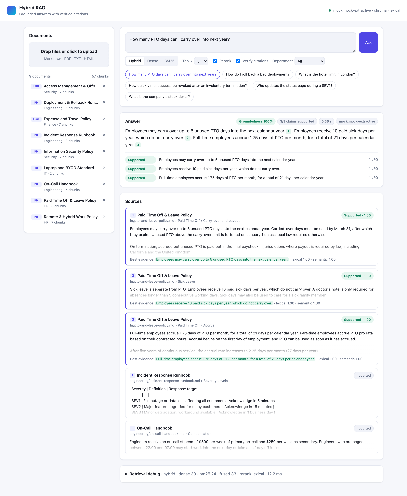
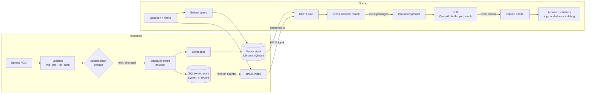
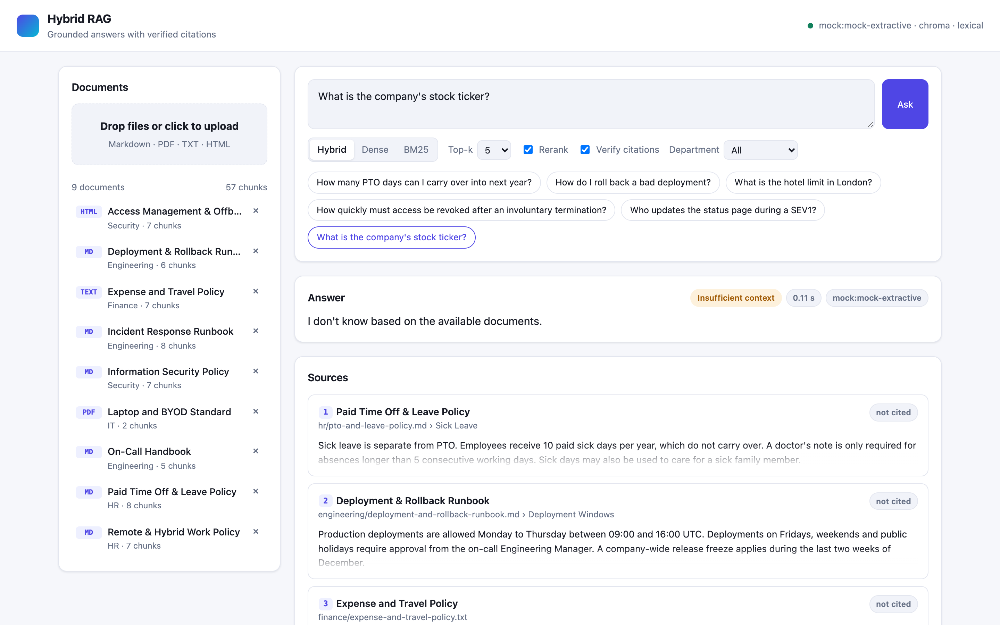

# Hybrid RAG

**Question answering over internal company docs. It retrieves with dense vectors and BM25 together, reranks with a cross-encoder, answers only from the retrieved text, and checks every citation after the answer is written.**

[](https://github.com/aqkprogrammer/rag-hybrid-search/actions/workflows/ci.yml)


Most RAG demos stop at "embed, top-k, stuff the prompt". This project covers the parts a production
system needs on top of that:

- **Hybrid retrieval.** Dense embeddings and BM25 are fused with Reciprocal Rank Fusion, then a
  cross-encoder reranks the fused list. Every stage's rank and score comes back in the API response.
- **Grounded generation.** The model may answer only from numbered passages, must cite them inline
  like `[1]`, and must say *"I don't know"* when the passages don't contain the answer.
- **Citation verification.** After generation, each sentence is checked against the passages it cites.
  Unsupported or out-of-range citations are flagged and removed, and a groundedness score is
  returned for each claim and for the whole answer.
- **A full product around it.** Idempotent ingestion for Markdown, PDF, TXT and HTML. Swappable
  vector stores (Chroma or Qdrant) and LLMs (OpenAI or Anthropic). SSE streaming, a web UI, a
  retrieval eval harness, Docker, and CI.

It runs end to end **without API keys or model downloads**. It ships with a deterministic mock
LLM, a hashing embedder and a lexical reranker, so a fresh clone runs its tests, demo and CI
offline in seconds. Environment variables switch it to real models.



---

## Contents

- [Features](#features)
- [Architecture](#architecture)
- [See it in action](#see-it-in-action)
- [Quickstart](#quickstart)
- [Configuration](#configuration)
- [API reference](#api-reference)
- [Design decisions and trade-offs](#design-decisions-and-trade-offs)
- [Evaluation](#evaluation)
- [Project structure](#project-structure)
- [Development](#development)
- [Roadmap](#roadmap)

## Features

| Area | What's implemented |
|---|---|
| **Ingestion** | Markdown (with YAML front matter), PDF (per page), TXT (setext/ALL-CAPS headings plus a `Key: value` header block), HTML (headings, lists, tables; nav and footer stripped). Upload one or many files, send raw text, or ingest a whole directory from the CLI. |
| **Idempotency** | SHA-256 content hashing. Re-ingesting a file returns `unchanged`. Changed content returns `updated`, which replaces the chunks and vectors atomically and keeps the `doc_id` stable. The same content under a different name returns `duplicate`. Documents can be deleted. |
| **Chunking** | Structure-aware recursive splitting (section → paragraph/code block → line → sentence → words), sized in tokens (tiktoken) with sentence-aligned overlap. Each chunk stores its heading breadcrumb as metadata. |
| **Retrieval** | Dense (Chroma/Qdrant/in-memory) and BM25 (a custom Lucene-IDF inverted index), fused with weighted RRF and reranked by a cross-encoder (`ms-marco-MiniLM-L-6-v2`). Supports metadata filters (`department`, `doc_type`, `source`, ...) and top-k per stage. |
| **Debuggability** | Every response includes dense, BM25, RRF and rerank ranks and scores for each candidate, plus a timing for each stage. The UI renders all of it as a table. |
| **Generation** | A system prompt that forces grounded answers with citations, refuses when context is insufficient, and treats passages as untrusted data (a prompt-injection guard). Supports OpenAI (GPT-4o family), Anthropic (`claude-sonnet-5`) and an offline mock. |
| **Verification** | Checks each cited sentence with lexical coverage, embedding similarity and a numeric-consistency guard, with an optional LLM judge. Claims that cite several passages are checked against the combined text. Returns a per-claim status, a groundedness score, and a cleaned answer. `/api/verify` also checks answers produced by *other* systems. |
| **Serving** | FastAPI, SSE streaming plus a non-streaming endpoint, `/health`, structured JSON logs with request IDs, pydantic-settings configuration. |
| **UI** | A single-page app with no build step: drag-and-drop upload, document list with delete, mode/top-k/rerank/department controls, streamed answers, clickable citations colored by verification status, source cards showing the best evidence sentence, and a retrieval debug table. |
| **Ops** | Multi-stage non-root Docker image with a healthcheck, docker-compose with Qdrant, a Makefile, and GitHub Actions (ruff, mypy, pytest, eval, docker build). |

## Architecture



**Request flow for `POST /api/query/stream`:**

1. `retrieval` event: the passages that will be sent to the LLM, with per-stage debug scores.
2. `token` events: answer deltas streamed from the provider.
3. `verification` event: the final answer, per-claim verification, groundedness, and the cleaned answer.
4. `done` event: latency, provider, model, and the refusal flag (an `error` event is sent instead if the provider fails).

## See it in action

These screenshots come from a local run with `make dev` and `make seed`, using the built-in mock LLM and no API keys.

**1. Load the sample corpus.** `make seed` uploads the 9 fictional company documents in `sample_docs/`: HR, engineering, security, finance and IT, in Markdown, PDF, TXT and HTML. They are split into 57 chunks. A second `make seed` reports every file as `unchanged`, because ingestion is idempotent.

```text
  created    6 chunks  engineering/deployment-and-rollback-runbook.md
  created    8 chunks  engineering/incident-response-runbook.md
  created    7 chunks  finance/expense-and-travel-policy.txt
  created    2 chunks  it/laptop-and-byod-standard.pdf
  created    7 chunks  security/access-management-and-offboarding.html
  ...
```

**2. Ask a question.** For *"How many PTO days can I carry over into next year?"*, shown at the top of this README:

- **Retrieval:** hybrid retrieval finds the right sections of the PTO policy.
- **Answer:** the model answers only from those passages, with inline citations `[1] [2] [3]`.
- **Verification:** the verifier checks every cited sentence against its source. All 3 claims are *Supported*, so groundedness is 100%.
- **Sources:** each source card highlights the exact evidence sentence and shows its lexical and semantic support scores.
- **Retrieval debug:** the collapsible *Retrieval debug* panel shows every stage (dense 30 → BM25 24 → fused 33 → reranked) with per-stage ranks, scores and timings.

**3. Ask something the documents don't cover.** *"What is the company's stock ticker?"* is refused with *"I don't know based on the available documents."* and labelled *Insufficient context*. The model does not invent an answer.



**4. Try the other controls.**

- **Search modes:** switch between *Hybrid*, *Dense* and *BM25*.
- **Reranking and verification:** turn the reranker or citation verification off.
- **Filters:** filter by department.
- **Documents:** drag your own files onto the upload area.

## Quickstart

### Local (uv)

```bash
make install        # uv sync: core + dev deps (no torch, installs in seconds)
make dev            # API + UI on http://localhost:8000 (mock LLM, fully offline)
make seed           # in a second terminal: upload sample_docs/ through the API
```

Open <http://localhost:8000> and try *"How many PTO days can I carry over?"* or
*"What is the company's stock ticker?"* (the second one is refused).

Command-line equivalents:

```bash
uv run hybrid-rag ingest sample_docs                          # ingest without a server
uv run hybrid-rag search "rollback command" --mode hybrid     # retrieval with per-stage ranks
uv run hybrid-rag ask "How long is parental leave?"           # answer + citations + groundedness
uv run hybrid-rag eval                                        # retrieval benchmark
```

### Use real models

```bash
cp .env.example .env
# LLM
echo 'LLM_PROVIDER=anthropic'          >> .env   # or openai
echo 'ANTHROPIC_API_KEY=sk-ant-...'     >> .env   # model: claude-sonnet-5 (ANTHROPIC_MODEL)
# Local embeddings + cross-encoder (installs CPU torch, about 1 GB)
make install-ml
echo 'EMBEDDING_PROVIDER=sentence-transformers' >> .env
echo 'RERANKER=cross-encoder'                   >> .env
```

If you switch the embedding model on an existing index, no manual migration is needed. Each model
gets its own collection, and startup re-embeds the chunks from the doc store (you can also run
`hybrid-rag reindex`).

### Docker

```bash
make up             # docker compose: API + Qdrant, sample docs auto-ingested on first start
open http://localhost:8000
make down
```

The default image is slim (no torch). To build it with local models:
`RAG_EXTRAS=ml docker compose up --build` (CPU-only torch wheels).

## Configuration

All settings are environment variables (or `.env`), validated by pydantic-settings. The full list
is in [`.env.example`](.env.example).

| Variable | Default | Description |
|---|---|---|
| `LLM_PROVIDER` | `mock` | `mock`, `openai` or `anthropic` |
| `OPENAI_MODEL` / `ANTHROPIC_MODEL` | `gpt-4o` / `claude-sonnet-5` | Model IDs (any GPT-4o-family or Claude model) |
| `OPENAI_API_KEY` / `ANTHROPIC_API_KEY` | – | Required for the matching provider (checked at startup) |
| `ANTHROPIC_EFFORT` | unset | Optional `low` to `max` effort for Claude |
| `EMBEDDING_PROVIDER` | `hashing` | `hashing` (offline), `sentence-transformers`, `openai` |
| `EMBEDDING_MODEL` | `BAAI/bge-small-en-v1.5` | sentence-transformers model (query prefix applied automatically) |
| `VECTOR_STORE` | `chroma` | `chroma` (embedded), `qdrant`, `memory` |
| `QDRANT_URL` | unset | Qdrant server URL. If unset, Qdrant runs in embedded local mode |
| `CHUNK_SIZE_TOKENS` / `CHUNK_OVERLAP_TOKENS` | `320` / `48` | Chunk budget and sentence-aligned overlap |
| `RETRIEVAL_MODE` | `hybrid` | Default mode: `hybrid`, `dense` or `bm25` |
| `DENSE_TOP_K` / `BM25_TOP_K` | `30` / `30` | Candidates from each retriever |
| `RRF_K`, `DENSE_WEIGHT`, `BM25_WEIGHT` | `60`, `1.0`, `1.0` | Fusion parameters |
| `RERANKER` | `lexical` | `cross-encoder`, `lexical` (offline stand-in), `none` |
| `RERANK_CANDIDATES` / `FINAL_TOP_K` | `20` / `5` | Rerank pool size and number of passages sent to the LLM |
| `VERIFY_CITATIONS` | `true` | Run the verifier on every answer |
| `VERIFIER_THRESHOLD` / `VERIFIER_LEXICAL_WEIGHT` | `0.55` / `0.5` | Support threshold and lexical/semantic mix |
| `VERIFIER_LLM_JUDGE` | `false` | Also ask the LLM for a SUPPORTED/NOT_SUPPORTED verdict per citation |
| `AUTO_SEED_DIR` | unset | Ingest this directory at startup if the index is empty |
| `LOG_FORMAT` | `console` | `json` for structured production logs |

## API reference

Interactive docs are served at `/docs` (Swagger) and `/redoc`.

| Method | Path | Description |
|---|---|---|
| `GET` | `/health` | Liveness plus component status (providers, counts, vector store, BM25 index) |
| `GET` | `/api/config` | Non-secret settings and filter facets (used by the UI) |
| `POST` | `/api/documents` | Multipart upload (`files`, optional `department`, `owner`, `classification`) |
| `POST` | `/api/documents/text` | Ingest raw Markdown/text: `{title, text, metadata}` |
| `GET` | `/api/documents` | List documents |
| `GET` | `/api/documents/{doc_id}?include_chunks=true` | Document detail, optionally with its chunks |
| `DELETE` | `/api/documents/{doc_id}` | Delete a document with its chunks and vectors |
| `POST` | `/api/search` | Retrieval only, with per-stage debug |
| `POST` | `/api/query` | Answer + citations + verification + retrieval debug |
| `POST` | `/api/query/stream` | Same as `/api/query`, streamed as Server-Sent Events |
| `POST` | `/api/verify` | Verify any answer's `[n]` citations against stored chunk IDs |

<details>
<summary>Example: query</summary>

```bash
curl -s localhost:8000/api/query -H 'content-type: application/json' -d '{
  "question": "How quickly must access be revoked after an involuntary termination?",
  "mode": "hybrid", "top_k": 5, "rerank": true,
  "filters": {"department": "Security"}
}'
```

```jsonc
{
  "answer": "For involuntary terminations, access must be revoked within 1 hour of the termination meeting [1]. ...",
  "verified_answer": "...",           // unsupported / invalid citation markers removed
  "refused": false,
  "citations": [{"index": 1, "title": "Access Management & Offboarding Standard",
                 "heading_path": ["Offboarding", "Involuntary departures"], "cited": true, "snippet": "..."}],
  "verification": {
    "groundedness": 1.0, "supported_claims": 2, "total_claims": 2,
    "unsupported_citations": [], "invalid_citations": [],
    "claims": [{"claim": "...", "status": "supported", "score": 1.0,
                "citations": [{"index": 1, "supported": true, "lexical": 1.0, "semantic": 1.0,
                               "numbers_ok": true, "evidence": "For involuntary terminations, ..."}]}],
    "method": "lexical(0.50)+embedding(hashing-v1)+numeric"
  },
  "retrieval": {
    "mode": "hybrid", "reranker": "lexical",
    "timings_ms": {"embed_query": 0.12, "dense": 2.1, "bm25": 5.0, "fusion": 0.04, "rerank": 0.77, "total": 8.5},
    "candidates": [{"chunk_id": "e0120e83c64ce1e5-0004", "dense_rank": 1, "dense_score": 0.486,
                    "bm25_rank": 1, "bm25_score": 16.11, "rrf_rank": 1, "rrf_score": 0.0328,
                    "rerank_rank": 1, "rerank_score": 0.579, "selected": true}]
  }
}
```
</details>

<details>
<summary>Example: streaming (SSE)</summary>

```bash
curl -N localhost:8000/api/query/stream -H 'content-type: application/json' \
  -d '{"question": "Who updates the status page during a SEV1?"}'
```

```text
event: retrieval
data: {"citations": [...], "retrieval": {...}}

event: token
data: {"text": "For "}
...
event: verification
data: {"answer": "...", "verified_answer": "...", "verification": {...}, "citations": [...]}

event: done
data: {"refused": false, "latency_ms": 575.5, "provider": "mock", "model": "mock-extractive"}
```
</details>

<details>
<summary>Example: catching a hallucination with /api/verify</summary>

```bash
curl -s localhost:8000/api/verify -H 'content-type: application/json' -d '{
  "answer": "EV chargers are limited to 4 hours per car [1]. Parking is first come, first served [1].",
  "chunk_ids": ["9d7c62faaaed9199-0000"]
}'
# -> verified_answer: "EV chargers are limited to 4 hours per car. Parking is first come, first served [1]."
#    claims: [unsupported (numbers_ok=false, source says 2 hours), supported]
```
</details>

## Design decisions and trade-offs

### Chunking strategy

Chunking has more effect on retrieval quality than almost any other setting. The chunker follows these rules:

1. **Structure first.** Loaders turn every format into the same list of *sections*, where a section
   is the text under one heading breadcrumb (or one PDF page). **A chunk never spans two sections**,
   so each chunk has exactly one breadcrumb, such as `PTO Policy > Paid Time Off > Carry-over`.
2. **Recursive, coarse to fine.** Inside a section the chunker splits on paragraphs first. Fenced
   code blocks are atomic, so blank lines inside code never cause a split. Only oversized blocks
   are split further, by line, then by sentence, then (as a last resort) by word windows. Chunks
   therefore end on natural boundaries whenever possible.
3. **Token-based sizing.** Size is measured in tiktoken tokens rather than characters, so the
   budget means the same thing to the embedder and the LLM. The default is **320 tokens**: large
   enough to hold a complete policy clause with its conditions, small enough that a top-5 context
   stays under about 2k tokens and each chunk's embedding stays focused on one topic.
4. **Sentence-aligned overlap (48 tokens, about 15%).** Each chunk starts with the last whole
   sentences of the previous chunk, so a fact that crosses a boundary survives. Sentences are never
   cut in half, and a chunk made only of overlap is never emitted.
5. **Small pieces are merged.** A tiny trailing remainder is merged into the previous chunk. A tiny
   parent section, such as a one-line intro under `## Leave`, is folded into its first sub-section.
6. **Contextual headers.** Each chunk is embedded and BM25-indexed with `title > breadcrumb` prepended
   (`Chunk.contextual_text`). A chunk that just says *"Employees receive 10 days"* then still matches
   *"sick leave"* queries. The LLM sees the breadcrumb in the passage header, and the stored chunk
   text stays clean.

### Why hybrid, and why RRF

Dense retrieval handles paraphrase ("time off when a relative dies" → *bereavement*). BM25 handles
exact identifiers that embeddings blur: tool names (`Kandji`, `Gatekeeper`), commands
(`/incident declare`), error codes and ticket IDs. Internal docs are full of these.
The two retrievers produce scores on incomparable scales: cosine similarity is bounded, while BM25
scores are unbounded and depend on the corpus. **RRF uses only ranks** (`Σ wᵢ / (k + rankᵢ)`, k=60),
so it needs no score normalization or tuning, and a passage that ranks well in both lists beats
one that ranks first in only one.

### Why a cross-encoder reranker

Bi-encoders embed the query and the passage *separately*. A cross-encoder reads them *together*,
so it catches negation, qualifiers, and which entity a number refers to. It is too slow to run
over a whole corpus, which is why the pipeline retrieves broadly (30 + 30 candidates → 20 fused)
and reranks narrowly. The eval below shows the effect: with real models, reranking is the only
configuration that ranks every relevant passage in the top 3.

### BM25 implementation

The classic BM25 IDF (used by `rank_bm25`) is **zero or negative** for terms that appear in half
or more of the documents, so small or repetitive corpora score poorly and need epsilon hacks. The index
here uses the Lucene IDF `log(1 + (N - df + 0.5)/(df + 0.5))`, sparse postings, and immutable
snapshots swapped atomically, so readers never see a half-built index. It is derived state:
SQLite is the system of record, and a `revision` counter triggers a rebuild on startup and after
any write, including writes from another process such as the CLI. For millions of chunks, swap it
for OpenSearch, Tantivy or Postgres FTS behind the same `search()` signature.

### Grounding and refusal

The system prompt requires a citation on every factual sentence, a fixed refusal string when the
context is insufficient, flagging of conflicting passages, and treating passages as *untrusted data*
(this limits prompt injection through ingested documents). If retrieval returns nothing, for
example because a filter matches no documents, the service refuses without calling the LLM.

### Citation verification

LLMs still attach real-looking citations to sentences the passage doesn't support. For each claim
and each passage it cites, the verifier computes:

- **Lexical support.** The share of the claim's content terms (stemmed, without stop-words) that
  appear in the passage. This is recall-oriented: the passage must *cover* the claim.
- **Semantic support.** The best cosine similarity between the claim and any sentence of the
  passage. The best-matching sentence is returned as the *evidence*.
- **Numeric guard.** Every number in the claim must appear in the passage. "20 days" versus
  "25 days" is the most damaging error in policy QA, and neither lexical nor embedding similarity
  reliably catches it.
- **Optional LLM judge** (`VERIFIER_LLM_JUDGE=true`), for when accuracy matters more than an extra
  model call.

A citation counts as supported when `w·lexical + (1-w)·semantic ≥ threshold` and the numeric guard
passes. Claims that cite several passages are also checked against the combined text. Each claim is
labeled `supported`, `partially_supported`, `unsupported` or `uncited`. Answer groundedness is the
mean claim score. The UI shows the raw answer with failing citations struck through, and the API
also returns `verified_answer` with them removed.

### Other trade-offs

- **SQLite plus a derived vector index.** SQLite gives transactional document and chunk state,
  deduplication and deletes. The vector store is written first, then the doc store, so a crash
  leaves only orphan vectors, which retrieval ignores.
- **One collection per embedding model** (`docs-<model>-<dim>`). Switching models can never mix
  vector spaces.
- **Offline defaults.** The hashing embedder and lexical reranker are honest stand-ins: good enough
  for tests, CI and demos, and labeled as such. The mock LLM is extractive and deterministic, so
  every test that goes through the API is reproducible.
- **Anthropic specifics.** The code uses the Messages API (`messages.create` / `messages.stream`),
  sends no sampling parameters (current Claude models reject them), uses the default adaptive
  thinking, and turns `stop_reason == "refusal"` into a visible refusal.

## Evaluation

`hybrid-rag eval` builds an isolated in-memory index from `sample_docs/` and runs the 34 questions
in [`evals/retrieval_qa.jsonl`](evals/retrieval_qa.jsonl) through four configurations. The set
mixes paraphrased questions with exact-keyword queries (tool names, commands, severity codes).
A retrieved chunk counts as relevant if it comes from the expected document **and** contains an
expected answer phrase, which keeps the labels valid when chunking settings change.

**Real models** (`EMBEDDING_PROVIDER=sentence-transformers RERANKER=cross-encoder`, i.e. `bge-small-en-v1.5` + `ms-marco-MiniLM-L-6-v2`, CPU, Apple Silicon):

| Retriever | Hit@1 | Hit@3 | Hit@5 | MRR@10 | Latency (ms) |
|---|---:|---:|---:|---:|---:|
| dense | 0.91 | 0.97 | 0.97 | 0.941 | 18.0 |
| bm25 | 0.82 | 0.91 | 0.94 | 0.875 | 0.2 |
| hybrid (RRF) | 0.94 | 0.97 | 0.97 | 0.954 | 17.8 |
| **hybrid + rerank (cross-encoder)** | **0.97** | **1.00** | **1.00** | **0.985** | 92.1 |

**Offline defaults** (`hashing-v1` embeddings + lexical reranker, which is what CI runs):

| Retriever | Hit@1 | Hit@3 | Hit@5 | MRR@10 | Latency (ms) |
|---|---:|---:|---:|---:|---:|
| dense | 0.68 | 0.85 | 0.91 | 0.784 | 0.2 |
| bm25 | 0.82 | 0.91 | 0.94 | 0.875 | 0.1 |
| hybrid (RRF) | 0.79 | 0.91 | 0.94 | 0.860 | 0.2 |
| hybrid + rerank (lexical) | 0.85 | 0.91 | 0.94 | 0.888 | 0.9 |

How to read these results:

- With real embeddings, **each stage adds accuracy**: hybrid beats both single retrievers, and the
  cross-encoder closes the remaining gap. The per-question ranks in
  [`evals/results/`](evals/results) show where each stage wins. Dense ranks the bare query `Kandji`
  only 6th (the product name means little to the embedding model). BM25 finds nothing for
  *"Am I compensated for being woken up by a page at night?"* because the document says "paged
  between 22:00 and 07:00", and plain hybrid ranks that passage 9th. Hybrid + rerank ranks both first.
- The offline hashing "embedder" is lexical by design, so it adds little on top of BM25 and hybrid
  sits between the two. The pipeline and harness are the same; only the models differ.
- **Limitations:** 34 questions over 9 documents is a smoke test, not a benchmark, and absolute
  numbers are close to the ceiling. Treat the harness as a tool for evaluating *your* corpus: add
  question/answer pairs to the JSONL and re-run after every change to chunking, models or fusion
  weights.

## Project structure

```text
rag-hybrid-search/
├── src/hybrid_rag/
│   ├── api/              # FastAPI app factory, routes, SSE encoding
│   ├── ingestion/        # loaders (md/pdf/txt/html), structure-aware chunker, ingestion service
│   ├── storage/          # SQLite doc store (system of record), BM25 index, filter semantics
│   ├── vectorstores/     # Chroma, Qdrant, in-memory - one interface
│   ├── embeddings/       # hashing (offline), sentence-transformers, OpenAI
│   ├── retrieval/        # RRF fusion, rerankers (cross-encoder / lexical), hybrid retriever
│   ├── llm/              # OpenAI, Anthropic, deterministic mock
│   ├── generation/       # grounded prompt templates
│   ├── verification/     # claim parsing + citation verifier
│   ├── web/              # single-page UI (vanilla JS, no build step)
│   ├── rag.py            # orchestration: retrieve -> generate -> verify (sync + streaming)
│   ├── container.py      # composition root
│   ├── evaluation.py     # hit@k / MRR harness
│   ├── cli.py            # `hybrid-rag` CLI (serve, ingest, seed, search, ask, eval, reindex)
│   └── config.py         # pydantic-settings
├── sample_docs/          # fictional "Lumora Systems" handbook: HR, engineering, security, finance, IT
├── evals/                # retrieval Q/A set + saved results
├── tests/                # unit + API tests (offline)
├── scripts/              # sample PDF generator
├── Dockerfile · docker-compose.yml · Makefile · .env.example
└── .github/workflows/ci.yml
```

## Development

```bash
make check          # ruff lint + format check, mypy, pytest
make format         # auto-fix
make eval           # retrieval benchmark
make pdf            # regenerate the sample PDF (reportlab via `uv run` script deps)
```

The tests (`uv run pytest`) are fully offline. They cover the loaders, chunking invariants,
BM25/RRF math, all three vector store backends (Chroma embedded, Qdrant in-memory, numpy), the
idempotent ingestion lifecycle, retrieval modes, filters and debug output, the verifier (supported
answers, hallucinated numbers, invalid citations, multi-passage union, LLM judge), the Anthropic
request shape, and every HTTP endpoint including SSE framing.

## Roadmap

- Contextual chunk summaries (LLM-generated) and parent-document retrieval
- Query rewriting / multi-query and HyDE for short or ambiguous questions
- Persistent sparse index (Tantivy / OpenSearch) and learned sparse retrieval (SPLADE)
- Per-document ACLs enforced as retrieval filters
- Answer-level evals (faithfulness, answer relevance) with an LLM judge, tracked in CI
- Conversation memory and follow-up question condensation
- OCR for scanned PDFs and table-aware PDF extraction

## License

[MIT](LICENSE)
